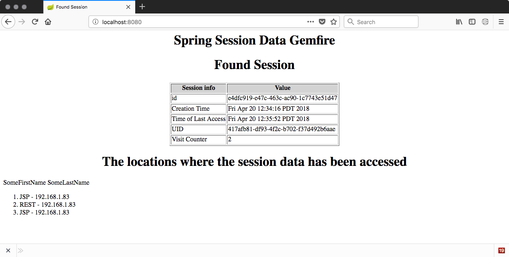

# Spring Session State Caching for Pivotal GemFire

In this example we will explore some code that allow session state to be stored in GemFire.  Some reasons for externalizing the session state to some database like GemFire is to allow:

* Application containers to fail with out impact to the logged in user.
* Application scaling to not impact the logged in user.
* Sharing of session information if needed.

This example can work with any of the versions of GemFire, which include Apache Geode, Pivotal Cloud Cache and Pivotal GemFire.   Just make sure the versions are aligned based on the GemFire interoperability guidelines.

NOTE: Since GemFire has been instantiated in the application, the developer is also free to use all of the power of GemFire to enable highly performing, reliable and reactive applications!

# Conceptual Deployment

From a GemFire perspective the session data is just a key value to store.  So there isn't much to say over there are going to be spring boot applications using GemFire libraries to access GemFire servers for data operations.


In the following sections I will show how one can deploy this code to PCF or run it all local on your laptop.


# How to Build and Run

## Building

In this project I use gradle as the build tool.   

**Linux:**
```
./gradlew clean build
```

**Windows:**
```
gradlew clean build
```

That gradle command goes off and builds all of the artifacts that we need.

```
voltron:pivotal-gemfire-spring-session cblack$ tree
.
├── gemfire-session-common
│   └─── build
│        └─── libs
│            └── gemfire-session-common-0.0.1-SNAPSHOT.jar - The artifacts that are common across projects
├── gemfire-session-jsp
│    └── build
│        └── libs
│           └── gemfire-session-jsp-0.0.1-SNAPSHOT.war - The web app that is using JSP pages
└── gemfire-session-rest
    └── build
            └── gemfire-session-rest-0.0.1-SNAPSHOT.jar - Some rest service that is using the same session data that JSP need

```

## Deploy to PCF

### Check the market place for PCC
The first action we need is to start up GemFire, in the case of Pivotal Cloud Foundry (PCF) we call GemFire Pivotal Cloud Cache (PCC).   In a PCF environment we use PCC tile which is deployed to the PCF marketplace.   So lets check the market place to see if our foundation has the PCC tile installed.

```
voltron:pivotal-gemfire-spring-session cblack$ cf marketplace
Getting services from marketplace in org pivot-cblack / space development as cblack...
OK

service                       plans                                      description
p-cloudcache                  dev-plan                                   Pivotal Cloud Cache offers the ability to deploy a GemFire cluster as a service in Pivotal Cloud Foundry.

TIP:  Use 'cf marketplace -s SERVICE' to view descriptions of individual plans of a given service.
```
**Note**: I cleaned up the market place to remove tiles that I didn't want to highlight - so your market place may have differant tiles deployed than what I am showing.

Great we can see we have PCC installed and a plan avaible for me to use.  

### Create an instance of PCC.  

To create an instance of PCC  we use the ``cf create service`` command.

```
voltron:pivotal-gemfire-spring-session cblack$ cf create-service p-cloudcache dev-plan mypcc
Creating service instance mypcc in org pivot-cblack / space development as cblack...
OK

Create in progress. Use 'cf services' or 'cf service mypcc' to check operation status.
```
The name I gave the instance ``mypcc`` is reused in the manifests for deploying to PCF.   If you deploy with another name just change the ``manifest.yml`` or override it on the command line.

After creating the service instance we need to create a service key so applications can bind to the instance.

```bash
voltron:gemfire-session-jsp cblack$ cf create-service-key mypcc mypcc-key
Creating service key mypcc-key for service instance mypcc as charlie...
OK
```

### Create the region in GemFire

To create the region we need to use GemFire's command line tool called ``gfsh``.   This tool is packaged in GemFire and can be downloaded from Pivotal network or installed via brew.

** Brew instructions: ** http://gemfire.docs.pivotal.io/gemfire/getting_started/installation/install_brew.html

Just make sure the versions are the same as the server instance.

Below we run ``gfsh`` and connect to PCC and create the region that we are going to be storing the session information in.   

```
voltron:gemfire-session-jsp cblack$ gfsh
    _________________________     __
   / _____/ ______/ ______/ /____/ /
  / /  __/ /___  /_____  / _____  /
 / /__/ / ____/  _____/ / /    / /  
/______/_/      /______/_/    /_/    9.3.0

Monitor and Manage Pivotal GemFire

gfsh>connect --use-http=true --url=https://cloudcache-4a39ec68-77bb-410b-9e64-9f255bee1d6b.run.pcfbeta.io/gemfire/v1 --user=cluster_operator --password=hi_there
Successfully connected to: GemFire Manager HTTP service @ org.apache.geode.management.internal.web.http.support.HttpRequester@6f48ccda

Cluster-0 gfsh>create region --name=test --type=PARTITION --entry-idle-time-expiration=180 --entry-idle-time-expiration-action=INVALIDATE --enable-statistics=true
                     Member                      | Status
------------------------------------------------ | ----------------------------------------------------------------------------
cacheserver-bab4e45c-2be8-409c-953f-3da25ed35e58 | Region "/test" created on "cacheserver-bab4e45c-2be8-409c-953f-3da25ed35e58"

Cluster-0 gfsh>
```

** NOTE: **  I added expiration to the data - this will have the effect of invalidating the session after 180 seconds have gone by.
** NOTE: ** Spring Session also has a concept of expiration.   This was done because not all database are as awesome as GemFire so spring session has to manually check if the session is still valid on access.

### Deploy the apps

Deploying applications PCF all we need todo is ``cf push`` for our two applications.   I will show the output of the script for one of those apps - the other is same.

```
voltron:gemfire-session-rest cblack$ cf push
Using manifest file /Users/cblack/dev/projects/opensource/pivotal-gemfire-spring-session/gemfire-session-rest/manifest.yml
...
     state     since                    cpu    memory         disk           details
#0   running   2018-04-20 11:41:46 AM   0.0%   356.2M of 1G   186.6M of 1G

```
Don't forget to push the JSP and the REST applications.

## Run the Example

I have setup a contrived example to keep the number moving parts to a minimum.   So please forgive if it isn't 100% correct way todo something.

We have two applications:

1. A JSP application acting as a view a user might be using
2. A REST application that interacts with the session that the JSP page is using

The JSP page will display the typical details of session along with any development items in the session.   Some of the extra items:

1. Create some kind of GUID for the heck of it
2. Track JSP page views
3. Add a domain object that has a user name and tracks the apps that have touched the session.

With the tracking we can see that the JSP page and the REST applications have touched the session.

### What are the URLs?

For this we look at the ``routes`` that PCF created.   In the manifest I asked PCF to create random routes so your application may be different.
```
voltron:gemfire-session-rest cblack$ cf routes
Getting routes for org pivot-cblack / space development as charlie ...

space         host                                                        domain       port   path   type   apps                          service
development   gemfire-spring-session-jsp-nonchromosomal-tariff            pcfbeta.io                        gemfire-spring-session-jsp
development   gemfire-spring-session-rest-alchemic-tangle                 pcfbeta.io                        gemfire-spring-session-rest
```

There we can see the two routes that PCF has made.   So lets emulate a user visiting our web site and potentially logging in.   From the JSP we perspective we using cookies to track sessions.

#### Visit the JSP app
So in our environment we would visit ``https://gemfire-spring-session-jsp-nonchromosomal-tariff.pcfbeta.io/``


Above is after visiting the page twice.

#### Visit the REST app

Now that we are "logged in" through the JSP page and have established a session we can reuse the session id as the token that we pass to other services.   For the REST service we deployed it is looking for the session information to be in the ``X-Auth-Token`` header.   We can emulate a rest call using ``curl`` using the above session key that we cut-n-pasted.

** Request: **
```
voltron:gemfire-session-rest cblack$ curl https://gemfire-spring-session-rest-alchemic-tangle.pcfbeta.io/home -H "X-Auth-Token:4b0b8c28-1e32-46b6-a7e8-621e0a5ae9a1"
```
** Response: ** Here the rest service converts the session object ``user_object`` to JSON and returns that value
```
{
  "name" : "SomeFirstName",
  "lastName" : "SomeLastName",
  "locations" : [ "JSP - 5c4bae95-c3aa-498c-41b3-8018", "JSP - 5c4bae95-c3aa-498c-41b3-8018", "REST  - 44471b99-fe4b-48ef-6902-53db" ]
}
```
#### Revisit the JSP page

If we revisit the JSP page we can see in the tracker that we have our initial two page views, a REST call and our JSP session has touched this session.


## PCF Conclusion

Lots of moving parts, hopefully it makes sense and you have learned something from this example.

# Deploy to local

## Start GemFire Locally

### Install GemFire

First we need to start up GemFire so that needs to be installed.   That can be done through downloading from Pivotal or installing via Home Brew if you have a mac.

** Brew instructions: ** http://gemfire.docs.pivotal.io/gemfire/getting_started/installation/install_brew.html

### Start GemFire

The following scripts will launch GemFire and configure it for this example.

**Linux:**
```
scripts/startGemFire.sh
```
**Windows:**
```
scripts\startGemFire.bat

```

## Run the Applications

### Start the JSP app
```
voltron:pivotal-gemfire-spring-session cblack$ ./gradlew :gemfire-session-jsp:bootRun
```
### Start the REST app
```
voltron:pivotal-gemfire-spring-session cblack$ ./gradlew :gemfire-session-rest:bootRun
```

Now that we have the demo running it is same as running with PCF.   The only real difference is the URLs, and if something fails its up to me to fix it ;) .  

Everything will be running on localhost and the JSP page is on port 8080 and the REST service is on port 9090.

### Visit the JSP page

Emulate the user interacting with the application:

** url: ** http://localhost:8080/


### Call the REST service with the X-Auth-Token

Emulate the application calling the rest service.

** Request **
```
voltron:gemfire-session-jsp cblack$ curl http://localhost:9090/home -H "X-Auth-Token:e4dfc919-e47c-463c-ac90-1c7743e51d47"
```
** Response **
```
{
  "name" : "SomeFirstName",
  "lastName" : "SomeLastName",
  "locations" : [ "JSP - 192.168.1.83", "REST  - 192.168.1.83" ]
}
```
#### Visit the JSP page to see who has touched the sessions


